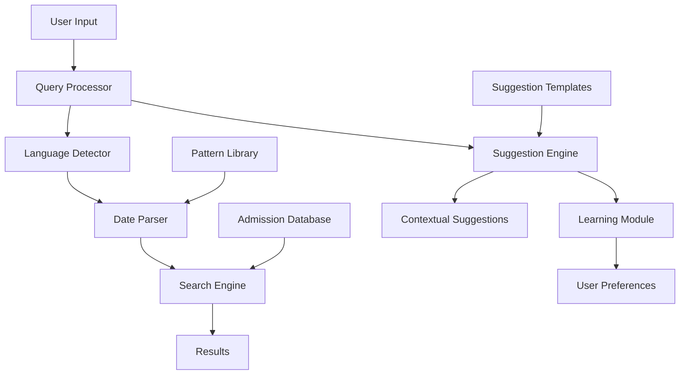

# Design Document

## Overview

The Intelligent Admission Date Search system is designed as a modular, real-time natural language processing engine that integrates seamlessly with the existing Flutter admission management application. The system employs a multi-layered architecture with specialized components for query parsing, suggestion generation, and adaptive learning.

## Architecture



The architecture follows a pipeline pattern where user input flows through specialized processors, while the suggestion system operates in parallel to provide real-time recommendations.

## Components and Interfaces

### 1. Query Processor
**Purpose:** Central coordinator that orchestrates the parsing and interpretation of user input.

**Key Methods:**
```dart
class QueryProcessor {
  Future<SearchQuery> processInput(String userInput);
  bool isDateRelatedQuery(String input);
  SearchType determineSearchType(String input);
}
```

**Responsibilities:**
- Coordinate between language detection and date parsing
- Determine if input is date-related
- Route queries to appropriate processors
- Handle mixed language inputs

### 2. Language Detector
**Purpose:** Identifies the primary language and mixed-language patterns in user input.

**Key Methods:**
```dart
class LanguageDetector {
  LanguageInfo detectLanguage(String text);
  List<LanguageSegment> segmentMixedLanguage(String text);
  bool containsUrduText(String text);
  bool containsEnglishText(String text);
}
```

**Detection Strategy:**
- Unicode range analysis for Urdu characters (U+0600-U+06FF)
- Keyword pattern matching for English date terms
- Context-aware segmentation for mixed inputs

### 3. Date Parser
**Purpose:** Extracts date information from natural language text using pattern matching and NLP techniques.

**Key Methods:**
```dart
class DateParser {
  DateQuery parseUrduDateExpression(String text);
  DateQuery parseEnglishDateExpression(String text);
  DateRange extractDateRange(String text);
  bool isRangeQuery(String text);
}
```

**Pattern Library:**
- Year patterns: "سال (\d{4})", "year (\d{4})"
- Month patterns: "مہینہ (جنوری|فروری|...)", "month (january|february|...)"
- Range patterns: "سے...تک", "from...to", "between...and"
- Date patterns: "تاریخ (\d{1,2})", "date (\d{1,2})"

### 4. Search Engine
**Purpose:** Executes queries against the admission database and returns filtered results.

**Key Methods:**
```dart
class SearchEngine {
  Future<List<AdmissionRecord>> executeQuery(SearchQuery query);
  List<AdmissionRecord> filterByDateRange(DateRange range);
  List<AdmissionRecord> filterByExactDate(DateTime date);
  List<AdmissionRecord> filterByYear(int year);
  List<AdmissionRecord> filterByMonth(int month, int year);
}
```

**Query Optimization:**
- Index-based searching on admission dates
- Efficient range queries using binary search
- Caching for frequently accessed date ranges

### 5. Suggestion Engine
**Purpose:** Generates contextual suggestions based on user input and learning patterns.

**Key Methods:**
```dart
class SuggestionEngine {
  List<String> generateSuggestions(String currentInput);
  List<String> getContextualExtensions(String input);
  void updateSuggestionRanking(String selectedSuggestion);
  List<String> getPopularPatterns();
}
```

**Suggestion Strategy:**
- Template-based generation with dynamic placeholders
- Context-aware extensions that preserve user input
- Real-time ranking based on user selection patterns
- Fuzzy matching for incomplete inputs

### 6. Learning Module
**Purpose:** Tracks user behavior and adapts suggestions to improve relevance over time.

**Key Methods:**
```dart
class LearningModule {
  void recordSuggestionSelection(String suggestion, String context);
  Map<String, double> getSuggestionWeights();
  void updateUserPreferences(String pattern, double weight);
  void resetLearningData();
}
```

**Learning Strategy:**
- Frequency-based weighting with decay over time
- Context-sensitive pattern recognition
- Local storage using SharedPreferences
- Privacy-preserving data collection

### 7. Auto Date Fill Module
**Purpose:** Automatically populates admission date fields with current date when left empty during data entry.

**Key Methods:**
```dart
class AutoDateFillModule {
  DateTime getCurrentDate();
  String formatDateForStorage(DateTime date);
  bool isDateFieldEmpty(String? dateValue);
  String fillEmptyDateWithCurrent(String? dateValue);
  bool validateAutoFilledDate(DateTime date);
}
```

**Auto-Fill Strategy:**
- Detect empty or null date fields during form submission
- Fill with current system date in standardized format
- Allow user override of auto-filled dates
- Validate that auto-filled dates are not in the future

### 8. Status Based Date Fill Module
**Purpose:** Automatically fills relevant date fields when student status changes to specific states like Graduate or Struck Off.

**Key Methods:**
```dart
class StatusBasedDateFillModule {
  void handleStatusChange(StudentStatus oldStatus, StudentStatus newStatus, Map<String, dynamic> studentData);
  void fillGraduationDate(Map<String, dynamic> studentData);
  void fillStruckOffDate(Map<String, dynamic> studentData);
  void clearStatusDate(StudentStatus status, Map<String, dynamic> studentData);
  bool shouldAutoFillDate(StudentStatus status, String? currentDateValue);
}
```

**Status-Based Strategy:**
- Monitor student status changes in real-time
- Automatically fill graduation date when status changes to "Graduate"
- Automatically fill struck-off date when status changes to "Struck Off"
- Clear status dates when status changes away from Graduate/Struck Off
- Preserve manually entered dates and allow user overrides

## Data Models

### SearchQuery
```dart
class SearchQuery {
  final SearchType type;
  final DateQuery dateQuery;
  final String originalInput;
  final LanguageInfo languageInfo;
  final double confidence;
}
```

### DateQuery
```dart
class DateQuery {
  final DateTime? exactDate;
  final DateRange? range;
  final int? year;
  final int? month;
  final int? day;
  final QueryType type; // EXACT, RANGE, YEAR_ONLY, MONTH_YEAR
}
```

### LanguageInfo
```dart
class LanguageInfo {
  final Language primaryLanguage;
  final bool isMixed;
  final List<LanguageSegment> segments;
  final double confidence;
}
```

### SuggestionContext
```dart
class SuggestionContext {
  final String userInput;
  final List<String> previousSelections;
  final Map<String, double> patternWeights;
  final DateTime timestamp;
}
```

### AutoDateFillConfig
```dart
class AutoDateFillConfig {
  final bool isEnabled;
  final String dateFormat;
  final bool allowFutureDates;
  final bool requireUserConfirmation;
  final DateTime? maxAllowedDate;
}
```

### StudentStatus
```dart
enum StudentStatus {
  active,
  graduate,
  struckOff,
  transferred,
  dropout,
  suspended
}
```

### StatusDateMapping
```dart
class StatusDateMapping {
  final StudentStatus status;
  final String dateFieldName;
  final bool autoFillOnStatusChange;
  final bool clearOnStatusChange;
}
```

## Error Handling

### Input Validation
- **Invalid Date Ranges:** Detect and handle impossible date ranges (e.g., start date after end date)
- **Malformed Input:** Gracefully handle completely unrecognizable input with fallback suggestions
- **Empty Results:** Provide helpful suggestions when no records match the query

### Performance Safeguards
- **Query Timeout:** Implement 5-second timeout for complex queries
- **Result Limiting:** Cap results at 1000 records with pagination
- **Memory Management:** Implement LRU cache for suggestion patterns

### User Experience
- **Progressive Enhancement:** Show partial results while processing complex queries
- **Error Messages:** Provide clear, bilingual error messages
- **Fallback Behavior:** Default to basic text search when NLP parsing fails

## Testing Strategy

### Unit Testing
- **Pattern Matching:** Test all date pattern recognition with edge cases
- **Language Detection:** Verify accuracy across various mixed-language inputs
- **Suggestion Generation:** Validate suggestion quality and uniqueness
- **Learning Algorithm:** Test weight updates and preference persistence

### Integration Testing
- **End-to-End Queries:** Test complete user journeys from input to results
- **Performance Testing:** Validate response times under various load conditions
- **Database Integration:** Test query execution against sample admission data
- **Cross-Platform:** Ensure consistent behavior across iOS and Android

### User Acceptance Testing
- **Bilingual Users:** Test with native Urdu and English speakers
- **Real-World Queries:** Use actual administrator search patterns
- **Learning Effectiveness:** Measure suggestion improvement over time
- **Accessibility:** Ensure compatibility with screen readers and accessibility tools

## Performance Considerations

### Response Time Targets
- **Query Processing:** < 500ms for 95% of queries
- **Suggestion Generation:** < 200ms for real-time updates
- **Database Queries:** < 1s for datasets up to 10,000 records
- **Learning Updates:** < 50ms for preference recording

### Memory Optimization
- **Pattern Caching:** LRU cache with 100-pattern limit
- **Suggestion Storage:** Keep only top 50 patterns per context
- **Database Indexing:** Composite indexes on admission date fields
- **Lazy Loading:** Load suggestion templates on demand

### Scalability
- **Horizontal Scaling:** Design for multiple concurrent users
- **Data Growth:** Handle admission databases up to 100,000 records
- **Feature Extension:** Modular design for adding new search types
- **Localization:** Framework for adding additional languages